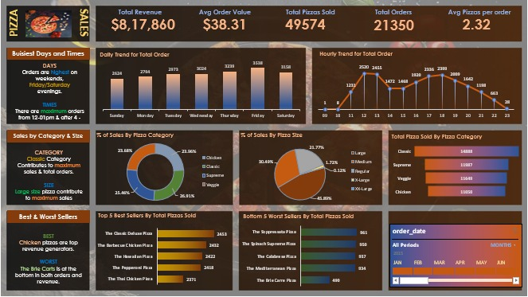

# 🍕 Pizza Sales Data Analysis

## 📌 Project Overview
This project analyzes a pizza sales dataset using SQL and Excel to generate meaningful business insights.  
The objective is to evaluate sales performance, customer ordering behavior, and product trends to support data-driven decision-making.

---

## 🛠 Tools & Technologies Used
- SQL (Data Aggregation & KPI Analysis)
- Microsoft Excel (Dashboard & Visualization)
- Pivot Tables & Pivot Charts
- Data Cleaning & Transformation

---

## 📊 Key Performance Indicators (KPIs)

The following KPIs were calculated using SQL:

- Total Revenue  
- Average Order Value  
- Total Orders  
- Total Pizzas Sold  
- Average Pizzas per Order  

---

## 📈 Business Insights Generated

- Daily and Hourly Order Trends  
- Percentage of Sales by Pizza Category  
- Percentage of Sales by Pizza Size  
- Top 5 Best-Selling Pizzas  
- Bottom 5 Lowest-Selling Pizzas  

These insights help identify peak sales hours, high-performing products, and customer preferences.

---

## 🗂 Dataset Description

The dataset contains:

- Order ID  
- Order Date  
- Order Time  
- Pizza Name  
- Category  
- Size  
- Quantity  
- Total Price  

---

## 📷 Dashboard Preview



---

## 🎯 Business Impact

This analysis helps businesses:

- Optimize inventory management  
- Improve pricing strategies  
- Focus marketing efforts on high-performing products  
- Identify underperforming items  

---

## 📁 Project Structure

```
Pizza-Sales-Data-Analysis/
│
├── Dashboard.xlsx
├── pizza_sales.csv
├── pizza_sales_queries.sql
├── dashboard_preview.jpeg
└── README.md
```


